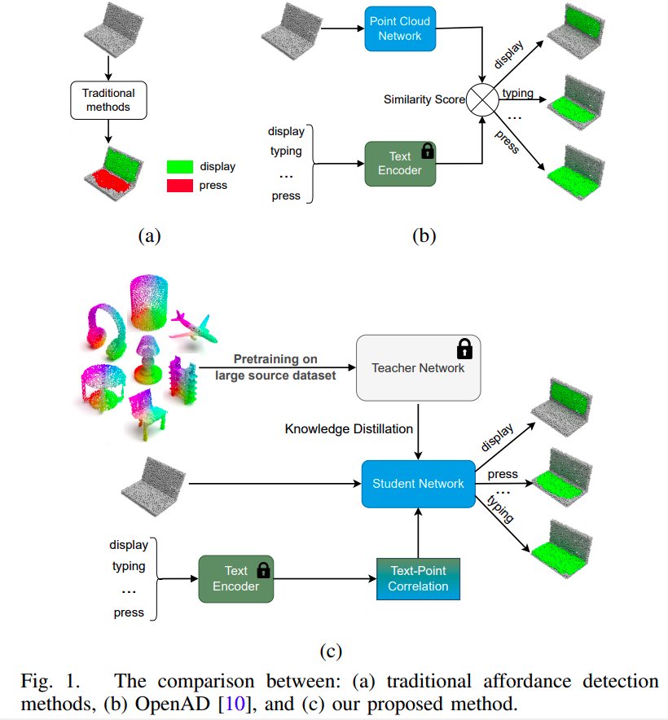
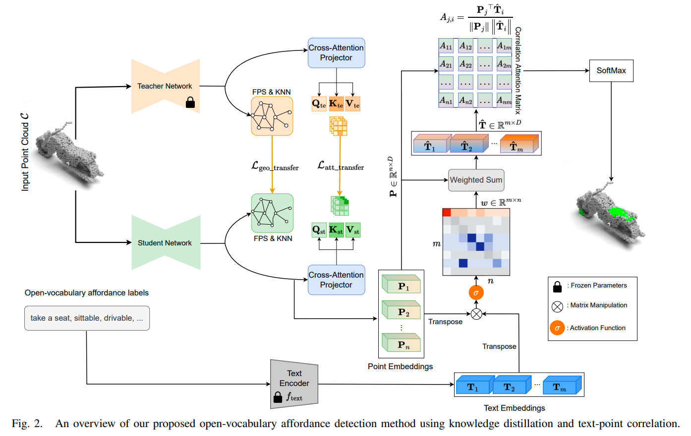
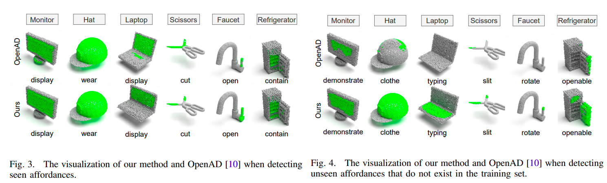
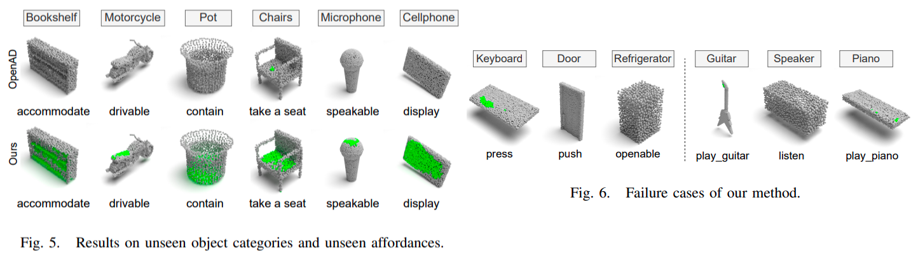

# [ICRA 2024] Open-Vocabulary Affordance Detection using Knowledge Distillation and Text-Point Correlation

Official code for the ICRA 2024 paper "Open-Vocabulary Affordance Detection using Knowledge Distillation and Text-Point Correlation".

Our paper is currently available at [this URL](https://arxiv.org/pdf/2309.10932). More information can be accessed via [our project page]().



# Abstract:
 Affordance detection presents intricate challenges and has a wide range of robotic applications. Previous works have faced limitations such as the complexities of 3D object shapes, the wide range of potential affordances on real-world objects, and the lack of open-vocabulary support for affordance understanding. In this paper, we introduce a new open-vocabulary affordance detection method in 3D point clouds, leveraging knowledge distillation and text-point correlation. Our approach employs pre-trained 3D models through knowledge distillation to enhance feature extraction and semantic understanding in 3D point clouds. We further introduce a new text-point correlation method to learn the semantic links between point cloud features and open-vocabulary labels. The intensive experiments show that our approach outperforms previous works and adapts to new affordance labels and unseen objects. Notably, our method achieves the improvement of 7.96% mIOU score compared to the baselines. Furthermore, it offers real-time inference which is well-suitable for robotic manipulation applications.



We introduce a new open-vocabulary affordance detection method in 3D point clouds, leveraging knowledge distillation and text-point correlation.Our approach employs pre-trained 3D models through knowledge distillation to enhance feature extraction and semantic understanding in 3D point clouds. We further introduce a new text-point correlation method to learn the semantic links between point cloud features and open-vocabulary labels.

## Getting Started
We strongly encourage you to create a separate CONDA environment.
```
conda create -n openad python=3.8
conda activate openad
conda install pytorch pytorch-cuda=11.6 -c pytorch -c nvidia
conda install pip
pip install -r requirements.txt
```

## Data
Download data from [this drive folder](https://drive.google.com/drive/folders/1f-_V_iA6POMYlBe2byuplJfdKmV72BHu?usp=sharing).

Currently, we support 2 models (OpenAD with backbones of [PointNet++](https://proceedings.neurips.cc/paper/2017/file/d8bf84be3800d12f74d8b05e9b89836f-Paper.pdf) and [DGCNN](https://dl.acm.org/doi/pdf/10.1145/3326362)) and 2 settings (full-shape and partial-view).

## Training
Please train the model on a single GPU for the best performance. Below are the steps for training the model with PointNet++ backbone on the full-shape setting, those of other combinations are equivalent.

* Dowloaed the techer pretrained-weight at here: https://drive.google.com/drive/folders/1doi0Ye1HPg5sALkcbkfyBeQA6f5NYNYq?usp=sharing

* In ```config/openad_pn2/full_shape_cfg.py```, change the value of ```data_root``` to your downloaded data folder, and change the path to class weights to the path of the file ```full_shape_weights.npy``` (contained in the data folder).
* Assume you use the GPU 0, then run the following command to start training:

		CUDA_VISIBLE_DEVICES=0 python3 train.py --config ./config/openad_pn2/full_shape_cfg.py --config_teacher './config/teacher/estimation_cfg.py' --checkpoint_teacher <path to your checkpoint teacher model> --work_dir ./log/openad_pn2/OPENAD_PN2_FULL_SHAPE_Release/ --gpu 0
    Where ```<path to your checkpoint model>``` is your dowloaed the pretrained teacher model.
## Open-Vocabulary Testing
The followings are steps for open-vocabulary testing a trained model with PointNet++ backbone on the full-shape setting, those of other combinations are equivalent.

* Change the value of ```data_root``` in ```config/openad_pn2/full_shape_open_vocab_cfg.py``` to your downloaded data folder.
* Run the following command:

		CUDA_VISIBLE_DEVICES=0 python3 test_open_vocab.py --config ./config/openad_pn2/full_shape_open_vocab_cfg.py --checkpoint <path to your checkpoint model> --gpu 0
	Where ```<path to your checkpoint model>``` is your traiend model.

## Visualization
The code for the visualize should be update at './visualization_scrips'





## Citation

If you find our work useful for your research, please cite:
```
    @inproceedings{van2023open,
    title={Open-vocabulary affordance detection using knowledge distillation and text-point correlation},
    author={Van Vo, Tuan and Vu, Minh Nhat and Huang, Baoru and Nguyen, Toan and Le, Ngan and Vo, Thieu and Nguyen, Anh},
    booktitle= ICRA,
    year={2024}
    }

```